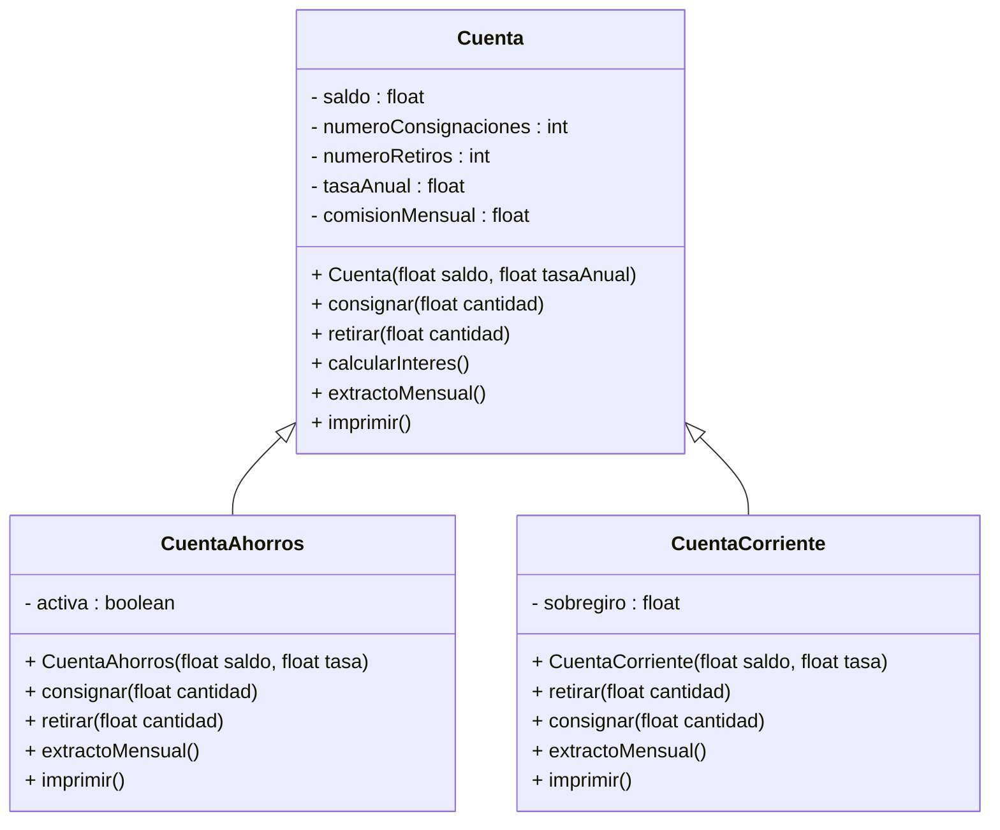

# Banco2
## Diagrama UML del Sistema de Cuentas Bancarias

```mermaid
classDiagram

class Cuenta {
  - saldo : float
  - numeroConsignaciones : int
  - numeroRetiros : int
  - tasaAnual : float
  - comisionMensual : float
  + Cuenta(float saldo, float tasaAnual)
  + consignar(float cantidad)
  + retirar(float cantidad)
  + calcularInteres()
  + extractoMensual()
  + imprimir()
}

class CuentaAhorros {
  - activa : boolean
  + CuentaAhorros(float saldo, float tasa)
  + consignar(float cantidad)
  + retirar(float cantidad)
  + extractoMensual()
  + imprimir()
}

class CuentaCorriente {
  - sobregiro : float
  + CuentaCorriente(float saldo, float tasa)
  + retirar(float cantidad)
  + consignar(float cantidad)
  + extractoMensual()
  + imprimir()
}

Cuenta <|-- CuentaAhorros
Cuenta <|-- CuentaCorriente
```